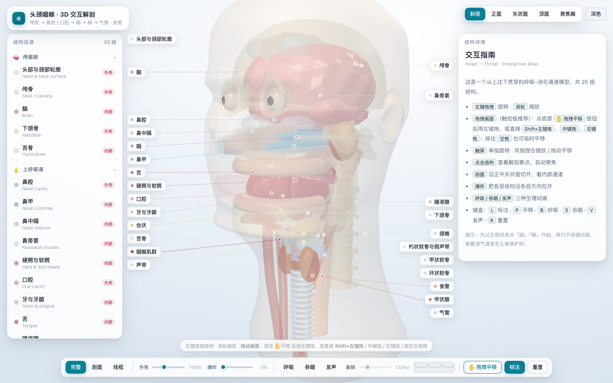
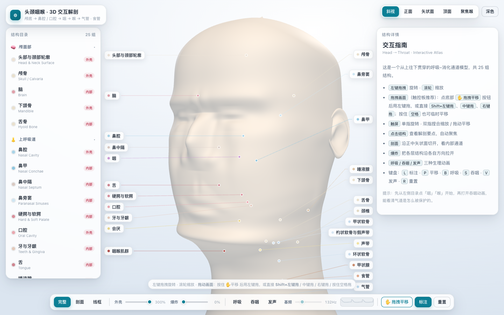
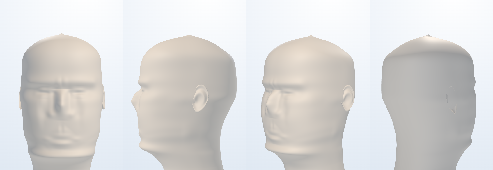

# 头颈咽喉 · 3D 交互解剖

一个纯前端的 **头部 → 咽喉** 3D 交互解剖模型。所有解剖结构均由代码程序化生成（无任何外部模型文件），
基于 **Three.js**（本地内置，离线可用），打开 `index.html` 即可运行。

## 🌐 在线访问

**https://season19840122.github.io/head-throat-3d/**

永久地址，无需 token、无需任何服务，手机也能开。





### 只看形体（影棚渲染）

下面这张是**隐藏全部 UI、只留皮肤外壳并做成实体、自动取景**的四视图 ——
用来单独检视「雕塑造形」本身，不受半透明与界面的干扰：



---

## 快速开始

### 方式零（最省事 · 在线，什么都不用下载）

打开 **https://season19840122.github.io/head-throat-3d/** —— 手机、平板都能开，也方便分享给别人。

### 方式一（离线 · 双击即开，零依赖）

**双击 `standalone.html`** —— 单文件自包含版，把所有模块与样式都内联在同一个 HTML 里，
用 Chrome 直接打开即可，**不需要任何 HTTP 服务**。

### 方式二（开发版 · 需要静态服务）

```bash
python3 -m http.server 8899
# 然后访问 http://127.0.0.1:8899/head-throat-3d/
```

`index.html` 是开发版，用 ES Module 加载 `js/*.js`。

> ⚠ **为什么双击 `index.html` 会一直卡在加载动画？**
> 因为 ES Module 在 `file://` 协议下会被浏览器以 **CORS** 为由直接拒绝
> （模块的 origin 是 `null`），`js/app.js` 一行都没执行 —— 而加载遮罩是靠脚本跑完
> 才隐藏的，所以就永远转圈。
> 现在 `index.html` 自带守卫：检测到 `file://` 就不再发起注定失败的模块请求，
> 而是直接把遮罩换成一句说明 + 指向 `standalone.html` 的按钮。

### 改完代码后同步单文件版

```bash
python3 build_standalone.py     # 读 index.html + js/* + vendor/* → 重新生成 standalone.html
```

`build_standalone.py` 是一个三十来行的极简打包器：把每个模块包成一个 IIFE，
静态 `import`/`export` 改写成作用域内的变量绑定与返回对象，按拓扑序串起来。
改完 `js/` 下的任何文件，**记得重跑一次**，否则 `standalone.html` 还是旧的。

---

## 交互方式

| 操作 | 效果 |
|------|------|
| 左键拖拽 | 旋转视角 |
| 滚轮 / 双指捏合 | 缩放 |
| **拖动整个画面（平移）** | ① 点底部 **✋ 拖拽平移** 按钮（或按 `P`），之后**左键拖拽即平移**；② 直接 **Shift + 左键拖拽**；③ **中键拖拽**；④ 右键拖拽；⑤ 按住 **空格** 临时平移（松手复原）；⑥ 触屏双指拖动 |
| 悬停结构 | 高亮 + 名称气泡 |
| 单击结构 | 选中 + 自动聚焦 + 右侧解剖详情 |
| 单击空白 | 取消选中 |
| 左侧目录点击 | 选中并飞向该结构 |

> **关于右键**：整个画面（画布 / 顶栏 / 底部控制台）都已屏蔽浏览器右键菜单，右键拖拽在各处都可用。
> 但 macOS 触控板的「右键」是双指点按，按下去难以持续拖动，所以触控板用户更推荐用
> **✋ 拖拽平移** 或 **Shift + 左键拖拽**。

**键盘快捷键**：`L` 标注 · `P` 平移模式 · `B` 呼吸 · `S` 吞咽 · `V` 发声 · `R` 重置 · `Esc` 取消选择 · `空格`（按住）临时平移

### 控制台功能

- **完整 / 剖面 / 线框** —— 剖面模式沿**正中矢状面**切开外壳，直接看到鼻腔→咽→喉→气管的连续通道
- **外壳** 滑块 —— 头部轮廓与颅骨的透明度（0～300%）
- **爆炸** 滑块 —— 20 组结构沿各自方向散开，看清层次关系
- **呼吸 / 吞咽 / 发声** —— 三种生理动画，见下
- **基频** 滑块 —— 80～320 Hz，实时改变声带振动频率与声门波形（发声模式）
- **标注** —— 引线标注开关

---

## 三个生理动画

1. **呼吸** —— 气管随呼吸周期轻微扩张；气流粒子沿真实气道走行（鼻腔 → 鼻咽 → 口咽 → 喉 → 气管）
2. **吞咽** —— 会厌向后下翻转盖住喉口、软腭上抬封闭鼻咽、舌根后推、喉体上提前移、声带内收；
   同时一个「食团」沿咽 → 食管下行，食管壁出现蠕动波。**这是全模型的核心教学点：气道保护。**
3. **发声** —— 声带周期性内收振动、声门发光；气流反向（气管 → 口腔）喷出；
   底部示波器显示声门脉冲波形，基频随滑块变化

---

## 模型包含的结构（25 组）

| 分区 | 结构 |
|------|------|
| 颅面部（5） | 头部与颈部轮廓、颅骨、脑、下颌骨、舌骨 |
| 上呼吸道（10） | 鼻腔、鼻甲、鼻中隔、鼻旁窦、硬腭与软腭、口腔、牙与牙龈、舌、唾液腺、咽 |
| 咽喉软组织（1） | 咽喉肌群 |
| 喉与声门（5） | 会厌、甲状软骨、环状软骨、杓状软骨与假声带、声带 |
| 下呼吸道与毗邻（3） | 气管、食管、甲状腺 |
| 参照结构（1） | 颈椎（C1–C7） |

每个结构都带有**位置 / 功能 / 临床要点**三段解剖说明，写在 `js/data.js` 中，可直接编辑扩充。

### 器官形态的建模取向

**「像不像器官」是这份模型的首要目标。** 有明确走向与转折的结构一律用独立网格建模，
不靠逐环径向扰动去凑：

- **硬腭**的横断面是一个**拱**（中间高、两侧低），不是一块平板；平板会看着像插了根板子。
  软腭单独做成可动瓣，带腭垂。
- **耳廓**用一个椭球体 + 一次 `deform` 雕出耳轮卷边 / 耳舟 / 对耳轮 / 耳甲腔 / 耳屏 / 耳垂，
  并且**内侧收成楔形**（贴颅面高度压到 0.70、进深压到 0.72），耳根长进颞骨而不是贴着一片板。
- **脑**做半球纵裂、脑回脑沟、颞叶、小脑叶片与脑干。
- 身体表面的**柔和起伏**（眉弓、眶、颧突、颊、下颌缘、颈项）用径向扰动叠加，因为它们本来就是渐变。

### 面部不是「贴上去的零件」，而是从一块料里减出来的

这是这个模型最重要的设计决定，也是改动最集中的一处：

- **鼻、唇、人中、眉弓、眼、颧、颊、下颌缘全部是外壳曲面上的起伏**，不是独立网格。
  早期版本把鼻子做成一拫从 z=6.3 斜插到 z=8.9 的锥体、把唇做成两根管子，
  结果鼻根永远埋在脸里、鼻尖永远翘在脸外，交界处留一道生硬的接缝 ——
  雕塑是从一整块石料里减出来的，五官必须和脸共用一个曲面。
- 外壳由 **900 层水平截面**堆成（`horizontalShell`），每层的形状来自三张剖面表：
  半宽 `rx`、后缘 `bz`、前缘 `fz`。三张表**统一以「最终世界 y」为自变量**
  （颏 = 5.20、颅顶 = 27.20、H = 22.0），代码里的数字就是解剖数字。
- 前缘剖面按人身法度校核过（Ricketts 审美线：上唇在鼻尖—颏前点连线后 4mm、
  下唇后 2mm；实测 4.2mm / 2.1mm）。鼻根是全脸唯一的最低点，眉弓是局部最高点，
  鼻尖比鼻根前 2.1 —— 「凸—凹—凸」的转折是脸的骨相所在。

### 形体光滑不是靠肉眼试参数试出来的

轮廓表由 **`makeProfile()` 自动生成**：粗锚点 → PCHIP 等距重采样 → 高斯磨光 → 自然三次样条（C²）。
三道工序各治一种病，缺一不可：

| 病 | 症状 | 治法 |
|----|------|------|
| 锚点自带**斜率跳变** | 自然三次样条振铃，体表出现横带（实测后枕部 world y≈22.4~23.2 处相邻层法线夹角跳到 6.15°、\|d²z/dy²\| 达 4.30，正常曲率只有 0.2 量级） | ② 高斯磨光（σ = 0.55，端点用**线性外推**而非镜像 —— 镜像会把端点导数强制为 0，在颅顶凭空造出一个平台） |
| 样条只有 **C¹** | 曲率在每个结点跳变 → 一圈圈横纹（「车床车出来的木胎」） | ③ 自然三次样条 |
| 纵向标定只有 **C¹** | `headY` / `reliftY` 的二阶导在 9 个锚点跳变 → 额头出现一圈实体台阶（实测落在 world y≈23.0，反推正是锚点 17.44） | 把映射在 0.05 网格上等距重采样后再做 C² |

同一指标最终从 **4.30 降到 0.77**，三条经线的相邻层法线夹角全部 ≤ 0.93°。

### 光照：一个亮源，不能两个

「颅顶那一圈贝雷帽」查了三轮才定性：**它不是形体，也不是平行光的 N·L 截断，而是两个亮源之间的暗带。**
旧版的环境贴图把「前上方柔亮斑」画在 canvas 的 (9, 26)，按 three.js 的等距柱状采样约定反推，
那是**方位角 −79°（左后方）**，而主光在**方位角 +39°（右前方）** —— 两个亮源几乎背对，
球面上必然夹出一条暗带。现在环境贴图改为**逐像素按方向生成**，主光斑与轮廓光斑
分别用 `dot(d, L)^n` 直接画在各自的真实方向上，球面上只剩一个主亮斑。

顶盖也必须是**穹顶**而不是平扇形：平扇形的法线整体垂直，外圈那一环却近乎水平，
一个面里转 80°，明暗上就是一圈「帽檐」。现在按幂律曲面收顶，
起始斜率用**多层基线**估（不能用最后一层 —— 那一层只有 0.035 高，噪声极大）。

---

## 坐标系与比例

- Y 轴向上，**+Z 为身体前方**（面部朝向），+X 为解剖学右侧
- 1 单位 ≈ 1 厘米；模型纵向范围 `y ∈ [-9.6, 27.87]`
- 面部法度基准：颏 5.20（0.000H）· 口裂 8.25 · 鼻底 12.24（0.320H）· 鼻尖 14.10（0.405H）·
  瞳孔 16.20（0.500H）· 鼻根 16.85 · 眉弓 18.10（0.586H）· 顶结节 17.96–20.8 · 颅顶 27.20（1.000H）
- 其余关键高度：硬腭 8.3 · 软腭游离缘 7.0 · 舌骨 4.0 · 环状软骨 1.4 · 气管末端 -7.4
- 剖面裁剪平面固定为 `x = 0`（正中矢状面）

---

## 文件结构

```
head-throat-3d/
├── standalone.html     # ★ 单文件自包含版（双击即开，无需服务；由 build_standalone.py 生成）
├── build_standalone.py # 极简打包器：js/* + vendor/* → standalone.html
├── index.html          # 开发版页面骨架 + 全部 UI 容器（含 file:// 守卫）
├── styles.css          # 浅色/深色主题、响应式布局（三栏 → 移动端抽屉）
├── js/
│   ├── data.js         # 25 组结构的中英文名、颜色、锚点、爆炸方向、解剖说明
│   ├── geo.js          # 程序化几何工具：变截面放样、水平截面壳体、C 形软骨环、骨板挤出、牙齿冠根、噪声变形
│   ├── textures.js     # 程序化贴图：皮肤 / 黏膜 / 肌肉 / 软骨 / 脑 / 舌背 的法线与粗糙度
│   ├── anatomy.js      # 全部结构的建模与装配（rig = 爆炸容器 + 动画枢轴）+ 体表轮廓剖面
│   ├── labels.js       # 引线标注层（投影 + 防重叠 + 界面安全区避让）
│   └── app.js          # 场景 / 光照 / 交互 / 动画 / UI 装配
└── vendor/
    ├── three.module.js # three.js r170
    └── OrbitControls.js
```

---

## 实现要点

- **程序化几何**：`geo.js` 里的 `loft()` 沿任意曲线生成**变半径椭圆截面**管腔，是鼻腔、咽、气管、
  食管、下颌骨、软腭的共同基础；`arcRing()` 生成 C 形软骨环；`plate()` 挤出骨板；
  `rippledSphere()` + `deform()` 生成脑回起伏；`horizontalShell()` 把水平截面堆成体表壳
- **装配体模式**：每个结构是 `outer`（爆炸位移）+ `inner`（动画枢轴）双层容器，
  因此「爆炸视图」与「吞咽动画」可以同时生效互不干扰
  （注意 `createRig()` 返回的是**普通对象** `{outer, inner, attach}` 而非 `THREE.Group`，
  写 `rig.visible = false` 是无效的 —— 要按 uuid 在根节点上开关）
- **拾取优先级**：皮肤不参与拾取；外壳层（轮廓/颅骨/颈椎）与**大面积覆盖层**（咽喉肌群）优先级最低，
  点击时会**穿透半透明外壳与肌群**，直接选到里面的器官
- **环境光照**：逐像素按方向生成等距柱状图经 `PMREMGenerator` 转成环境贴图，
  主光斑方向与 `DirectionalLight` 严格一致（见上文「一个亮源」）
- **性能**：约 71 万三角形 / 289 次绘制调用（外壳本体 23.3 万顶点），
  全部材质共用少量程序化贴图，桌面端可稳定 60fps

---

## 已知取舍

- 解剖形态是**示意级**而非医学影像级：用回转体、放样与基本体近似，用于理解「位置关系与功能通路」，
  不适合用于精确测量或影像对照
- **颅顶顶点**留了一个半径 0.50 的小环交给穹顶封口。理论上最圆的做法是让轮廓收到 0（一个点），
  但那样最后一环的顶点会退化重合、扇形法线出 NaN，所以留了一个小环 ——
  代价是顶点处约 0.3 单位高的一个圆润小凸起，正常观察距离看不出来。
- **眼睛**是刻在皮壳上的（上睑 / 睑裂 / 下睑 / 上睑沟 四笔），配合半透明皮肤里真实的眼球。
  不透明皮肤下它更像古典胸像的「未刻眼球」，而不是写实的开眼 —— 这是刻痕式建模的固有边界。
- 脑、鼻旁窦、颅底等结构做了简化；如需更精细模型，可在 `anatomy.js` 对应区块替换为 GLTF 加载
- 骨骼与器官之间允许轻微穿插（如舌根与会厌相邻处），与真实解剖的贴合关系一致

---

## 扩展指引

- **加一个结构**：在 `data.js` 的 `ORGANS` 里加一条（含 `id/name/en/group/color/anchor/explode/info`），
  再在 `anatomy.js` 加一个 `{ ... register('yourId', rig, mat.yourId, meshes) }` 区块即可，
  左侧目录、标注、详情卡会自动出现
- **换一本图谱**：`data.js` 的 `info` 字段是纯文本，替换为你的教材内容即可
